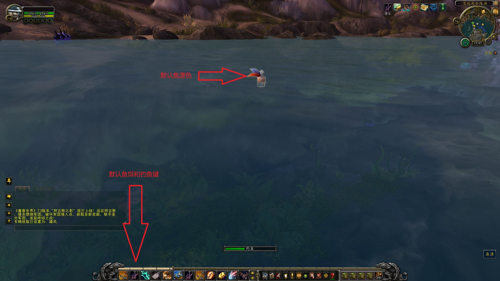

# wowfish

1.How to Compile
  Use devc++4.9+
  download devc++(https://bloodshed-dev-c.en.softonic.com/)
  
2.How to use this software

	2.1 运行本程序，登录游戏,抛出鱼竿开始钓鱼
	2.2 鼠标放鱼漂上，按Ctrl+A取色，将钓鱼技能放2技能栏上
	2.3 按F11启动自动钓鱼，然后你就可以去做其他事了
